# Architecture

How `my-brain` is put together, and why it is put together that way. `README.md` covers what the
tool does and how to use it; `AGENTS.md` covers the mechanics of changing the code. This document
sits between them and explains the shape.

Nothing here reproduces source. Where a detail is normative, the file that owns it is named.

## The split of responsibilities

`my-brain` is one half of a pair. The binary does the work that has to be exhaustive and repeatable.
The agent does the work that needs judgement. Neither one reaches into the other's half.

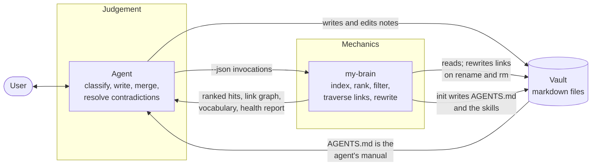

The loop through `AGENTS.md` is the interesting edge. `init` writes the agent's own operating
instructions into the vault, so the vault carries the manual for whatever version of the binary
last touched it. Re-running `init` after an upgrade refreshes the manual. A vault handed to a
different agent still explains itself.

## Layers

Four layers, each depending only on the ones above it. `lib/src/model.dart` is the shared contract:
`ScannedFile`, `DocRecord`, `SearchQuery`, `SearchHit`, `Posting`, `AttrCount`. Those types are
stable by convention, and changing one ripples through every layer.

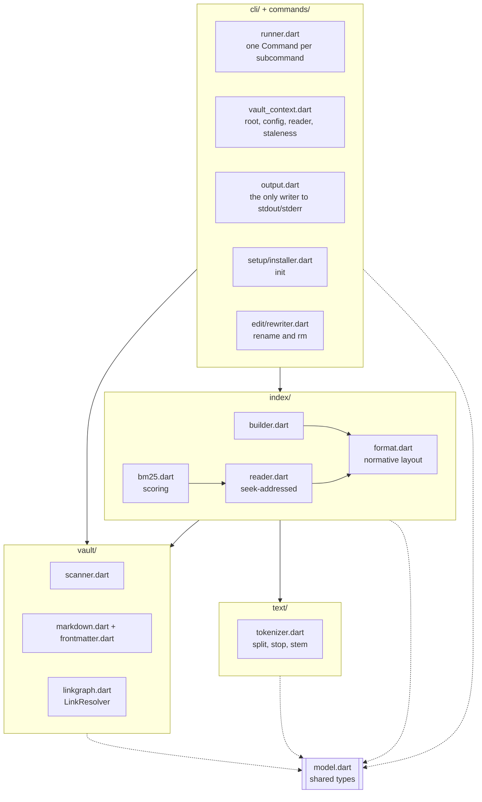

Two seams are worth naming because they were put there deliberately.

`IndexableDoc` is the only thing `IndexWriter` sees. The writer never learns that markdown exists,
so the on-disk format can be tested with synthetic documents and the parser can change without
touching the format.

`Output` is the only code that writes to stdout or stderr. `avoid_print` is a lint error, which
enforces it. That is what makes the `--json` contract cheap to guarantee: stdout carries exactly
one JSON document, everything else goes to stderr, and tests swap in a string buffer for both.

## What a vault looks like

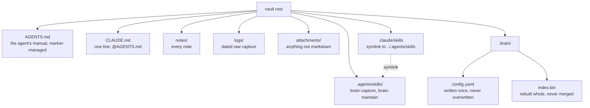

The symlink means an agent following the `AGENTS.md` convention and Claude Code read the same
files instead of two copies that drift apart. Where symlinks are unavailable the files are copied
and re-synced on every `init`.

Finding the root is the same trick git uses: `--vault` if given, otherwise walk upward from the
current directory looking for a `.brain/` directory. No vault means exit 3 and a message naming
`my-brain init`.

## The note model

The schema lives in the templates `init` installs, not in the code. That placement is the point,
so it is worth being explicit about which half holds what.

The vocabulary the instructions define:

- `type` is one of note, source, person, project, decision, question, log. `status` is one of seed,
  developing, stable, superseded, archived, plus open and answered on questions. The agent is told
  to ask before extending either list rather than inventing a value. A vocabulary that drifts is a
  filter that silently returns half an answer.
- `tags` carries the subject axis and nothing else. Type, status, project and priority are
  properties of their own, which is what makes `--filter type=decision --filter project=foo` answer
  "why is Foo built this way" and `--filter type=question --filter status=open` answer "what is
  still open".
- Notes live in `notes/`, dated raw capture in `logs/`, non-markdown in `attachments/`. The path
  carries that one distinction and the frontmatter carries the rest. Folders per type or per
  project would be a second copy of the schema, and it goes wrong the first time an open question
  is answered.
- Relations live in the body, in prose or as labelled lines like `**Supersedes:** [[...]]`.
- Inferences are written as inferences and carry `confidence:`. Raw input arrives as `type: log`,
  `status: seed`, and becomes knowledge only once it is split into typed, titled, linked notes.

The binary holds none of that. It defines no frontmatter keys, requires none, and rejects nothing,
because the ontology belongs to the vault and lives in `AGENTS.md` where you can edit it. Changing
the schema is a template edit, not a Dart change. The same goes for layout: `init` creates the three
directories, but no command cares where a note sits.

What the tool contributes instead is the two halves of schema discipline that have to be mechanical:

**`attrs`** reports the vocabulary the vault actually uses, counted, with no opinion about what it
should be. Drift shows up as a long tail, `project` 40 against `projects` 1, and what to do about
it stays a judgement. It also answers the question that made "reuse the existing tags" hard to
follow: an agent can ask the vault what it calls things instead of guessing from search hits.

**`doctor`** reports only facts about what this tool can do with a note. Two of them concern
frontmatter. A `---` block whose YAML did not parse leaves the note searchable but attribute-less,
so every `--filter` skips it silently. A `[[wikilink]]` written into a property is not an edge: no
backlink, no broken-link check, and `rename` will not rewrite it. Neither finding says anything
about which keys a note ought to carry.

That second one follows from a parser rule with wide consequences. **Links are read from the body
only.** The parser also excludes fenced blocks, indented blocks and inline code spans, because a
wikilink in a code sample is documentation rather than a graph edge, and rewriting it during a
rename would corrupt the sample. The rewriter shares the same code-range detection, so the two can
never disagree about what counts as code.

## Indexing

One command, one pass, whole vault. `index` scans, parses, analyses and writes.

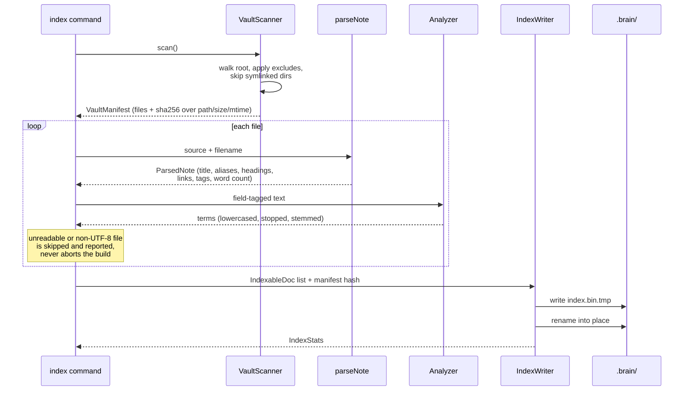

The atomic rename matters more than it looks. A crash mid-build leaves the previous index readable
rather than a half-written file that the reader has to defend against.

A file that cannot be read or cannot be decoded as UTF-8 is left out and named in the result. One
bad note should never leave the user with no index at all.

The manifest hash is the index's identity. It covers paths, sizes and mtimes, so comparing a fresh
scan against the hash stored in the header answers "is this index still current" without reading a
single file body.

### Why a full rebuild

Indexing is always a full rebuild, never an incremental merge, and the index never rebuilds itself.
Rebuilding a few thousand notes costs seconds. Incremental merging into a seek-optimised file is a
large amount of machinery whose failure mode is a silently wrong index, which is the worst thing a
retrieval tool can be.

The agent decides when to re-index, because it is the one that knows whether it just finished
writing.

## The index file

`.brain/index.bin` is a single region-based file, seek-addressable rather than loaded whole.
`lib/src/index/format.dart` carries the normative layout and its header comment is the spec.

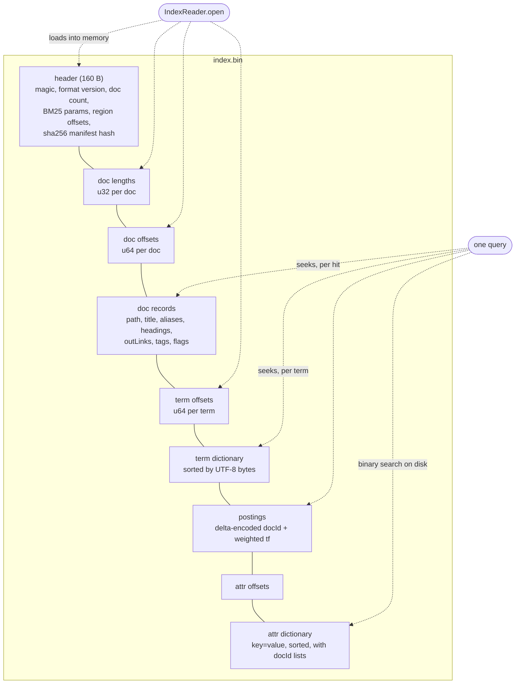

Opening the index loads the header and three small fixed tables. Everything else is seeked to on
demand: the postings of the query's own terms, the records of the handful of documents that make
the result list, and, for a filtered query, the attribute entries it names. The attribute offsets
table is never loaded at all; its binary search probes the file directly.

That is what keeps a cold search on thousands of notes in the tens of milliseconds. Do not
introduce a full-file deserialisation on the search path. The 5,000-note scale suite exists to
catch exactly that.

Compatibility is gated by the format version alone. The magic never moves, so a stale index reports
as an index that needs rebuilding instead of "not a my-brain file".

A corrupt index is adversarial input by nature, and it always has to surface as a clean exit 3.
Every fixed-size read checks it got the bytes it asked for, every offset is checked against the
real file length, and `openIndex` catches `Error` as well as `Exception` so a bug in that
validation still cannot dump a stack trace on the user.

## Searching

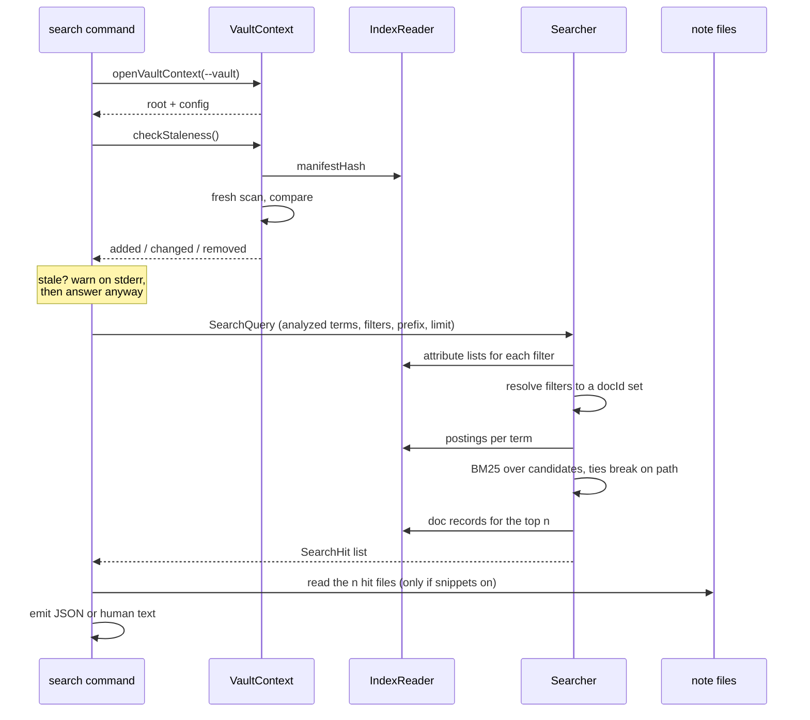

Filters resolve to a document-id set before scoring, so a filtered search costs no more than an
unfiltered one. Within one key the values are ORed, across keys they are ANDed. Every scalar and
list-of-scalars frontmatter key becomes filterable, so `project: alpha` in a note makes
`--filter project=alpha` work immediately with no configuration.

Ties break on path, so repeating a query returns the same order.

Snippets cost `limit` file reads, never a scan. The frontmatter is stripped before the window is
cut, because a snippet that opens mid-YAML shows the reader `status: developing ---` instead of the
sentence that matched.

`similar` runs the same machinery with the document's own highest-weight terms as the query and
itself removed from the results. That is duplicate detection: nothing more elaborate is needed.

### Analysis and scoring

The same analyzer configuration must run at index time and at query time, or a query term will
never match its indexed form. There is exactly one shared instance for that reason.

Field weights are folded into term frequency at build time. Title and aliases count triple,
headings and tags double, body once, which is what makes a note *about* a subject outrank one that
merely mentions it. Because the weights are already baked in, scoring is a single pass over the
postings with no per-hit field arithmetic.

Document length stays the raw token count. Weighting the length too would distort BM25's length
normalisation, and a heavily-titled note would look artificially long.

IDF uses the `ln(1 + (N - df + 0.5) / (df + 0.5))` form, which stays positive for a term appearing
in more than half the corpus. The raw Robertson-Sparck Jones form goes negative there and lets a
common term actively push a document down the list.

## Resolving a link or a note argument

`LinkResolver` answers one question, and both the link graph and every command that takes a note
argument ask it. Obsidian targets are ambiguous by design, so resolution is an ordered cascade.

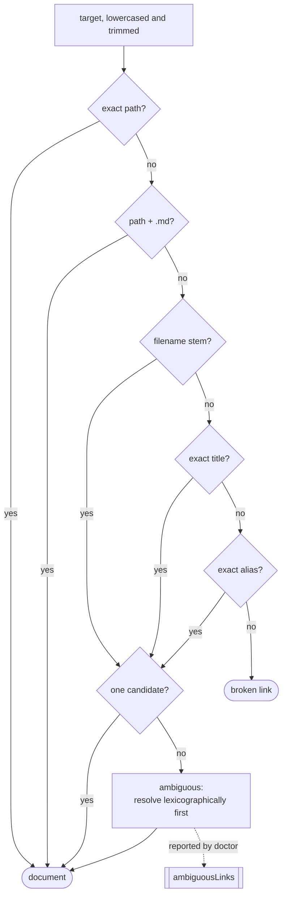

Every comparison is case-insensitive. Ambiguity resolves deterministically rather than failing,
because a link graph that changes shape between runs is worse than one that made a defensible
guess. `doctor` reports the ambiguity so it can be fixed at the source.

Commands taking a note argument use the same cascade, with one difference: ambiguity is an error
there, exit 1, listing the candidates. Guessing on a `rename` target would move the wrong file.

## Staleness, and who is allowed to be wrong

The index does not track the vault. It knows what it was built from, and it can tell you the vault
has moved. What each command does about that depends on whether it is about to write.

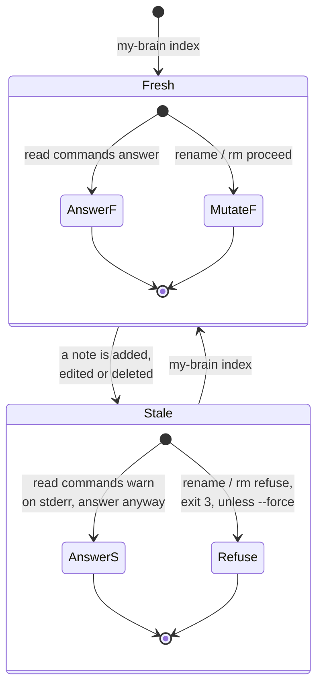

A stale read is a slightly incomplete answer, and the agent can judge whether that matters. A stale
rename is permanent damage: a note the index has not seen keeps its link to a file that no longer
exists, and nothing will ever go back and fix it. So reads warn and writes refuse.

`doctor` always exits 0. It is a report, not a gate, and an agent should never have to branch on
its exit code to find out whether it ran.

## Mutating notes

`rename` and `rm` are in the binary rather than in agent instructions for one reason: the work is
purely mechanical and has to be exhaustive. One missed referrer is a permanently orphaned link, and
an agent hand-editing dozens of files will eventually miss one.

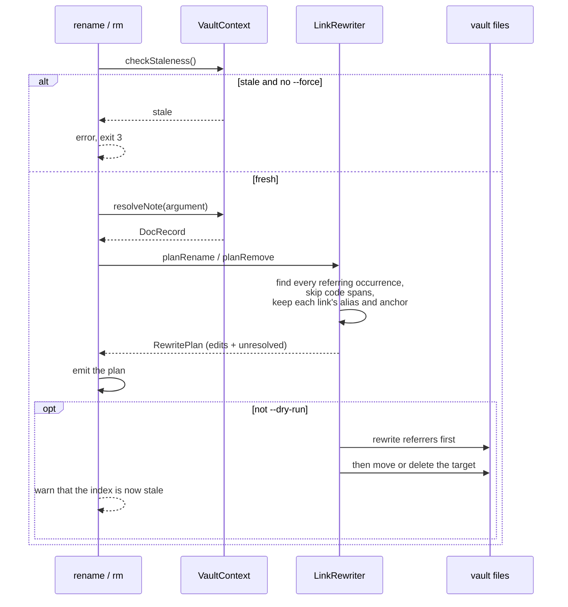

Referrers are rewritten before the target moves. An interrupted run then leaves links pointing at a
note that still exists, which is recoverable, rather than at one that does not.

The rewriter keeps each link's style. A link written as a bare name stays a bare name; one written
as a path stays a path. Turning `[[Deep Work]]` into `[[notes/deep-focus]]` would be correct and
also ugly, and a person has to read these notes afterwards.

On delete, a referring link becomes its display text, so the sentence around it still reads.

Anything the rewriter could not handle is listed as unresolved in the plan rather than silently
left dangling.

`--dry-run` emits the same plan and applies nothing.

## init and the templates

A compiled executable cannot read files from disk that are not there, so the templates ship inside
the binary.

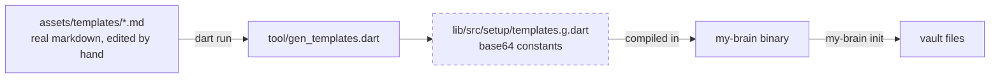

Edit the markdown under `assets/`, then regenerate. Never hand-edit the generated file. CI enforces
this by regenerating and failing if a tracked file changed.

`init` computes a plan, shows a diff for every file, and asks before writing. What it does to each
path depends on who owns it:

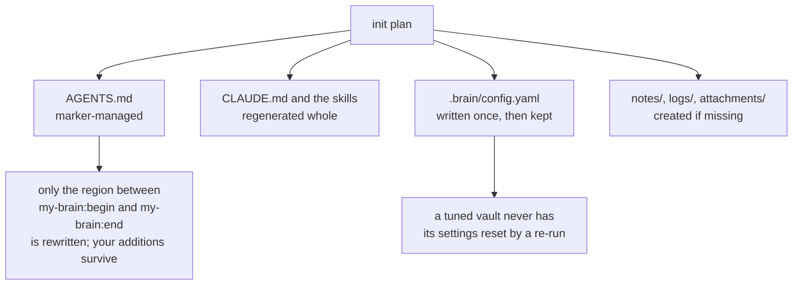

`init --check` reports drift and changes nothing, which is what makes it usable from a script.

## Output and exit codes

Every command takes `--json`, and that is the form an agent uses. In JSON mode stdout carries
exactly one document. Progress, warnings and errors go to stderr in both modes, so a stale-index
warning never corrupts a parse.

`Output.emit` takes both the JSON body and a human renderer, and runs exactly one of them. The two
representations cannot drift into different code paths, because there is only one call site per
result.

| Code | Meaning |
| --- | --- |
| 0 | Success. Also `doctor`, always, whatever it found. |
| 1 | Note not found, ambiguous, or a mutation refused. |
| 2 | Usage error. |
| 3 | No vault, no readable index, or a stale index blocking a mutation. |

## Measured behaviour

On a vault of 5,001 notes: 2.5s to build the index, roughly 130ms for a cold search including
process start, 130ms for a whole-vault `doctor` pass.

Those numbers are the reason several decisions above look the way they do. A 2.5s rebuild is what
makes "always rebuild, never merge" reasonable. A 130ms cold search is what makes a fresh process
per query reasonable, which is what makes the CLI shape reasonable in the first place. The scale
suite is tagged and skipped by default, and CI runs it on every pull request.

## Testing

`test/` mirrors `lib/src/`, so the tests for a file live at the same relative path.
`test/scale_test.dart` stays at the top level because it exercises the whole scan-index-search
path rather than one unit.

Tests import internals directly instead of going through what `lib/my_brain.dart` exports,
and integration-flavoured tests build a real vault under the system temp directory. The two seams
named earlier pay off here: the format is tested with synthetic documents that never touch the
markdown parser, and command output is asserted against injected string buffers that never touch
the process streams.
